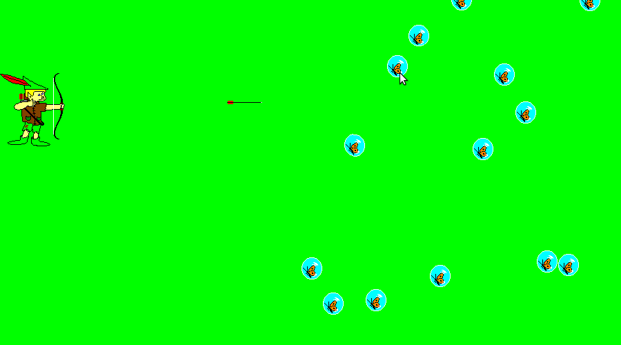

This game is a remake of the old Win95 game named Bow & Arrow.
This remake is entireley written in Common Lisp. 
This package has just 2 dependencies : lispbuilder-sdl, cl-fad
You can get lispbuilder-sdl with Quicklisp.
So, if you want to play :

* git clone https://github.com/ckairaba/bow-and-arrow.git
* cd bow-and-arrow
* lisp
* (pushnew "./" asdf:*central-registry*)
* (ql:quickload "bow-and-arrow")
* (bow-and-arrow:play)

## PLAY :

- right click to armed
- left click to stand (maintain)

<table align="center" width="100%">
  <tr>
    <td align="center">
      
    </td>
  </tr>
</table>

This package is theoretically portable. We just tested the package on
sbcl/linux, ccl/linux, clisp/linux and cmucl/linux.
We have implemented 3 levels. So, the next levels will come
soon.
